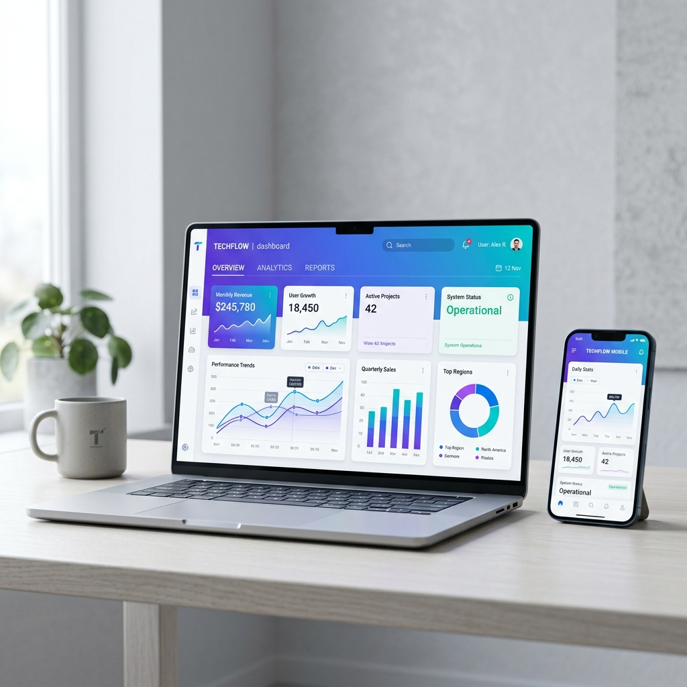

<div align="center">
  <h1>Friend Software</h1>
  <h3>Motion-first digital agency website built with React, Vite, Tailwind, GSAP, and Framer Motion.</h3>
  <p>
    A polished multi-page experience for showcasing services, ERP products, portfolio work, and lead generation
    with a modern 3D-inspired visual style.
  </p>
</div>

<div align="center">
  
</div>

<div align="center">


</div>

---

## Overview

Friend Software is a responsive agency website designed to present a premium digital brand with strong visual rhythm, smooth transitions, and conversion-oriented page flow. The interface blends glassmorphism, gradient lighting, floating mockups, animated counters, portfolio filtering, and ERP product storytelling into one cohesive experience.

This project is especially suited for software agencies, ERP businesses, IT consultancies, and marketing teams that want a website with a modern, high-end feel instead of a plain corporate template.

## Design Direction

- 3D-inspired hero presentation with floating device mockups and layered stat cards
- Motion-led storytelling powered by `GSAP` and `Framer Motion`
- Premium landing-page styling with gradients, blur, glow, depth, and soft shadows
- Multi-page structure with clear marketing sections and call-to-action flow
- Mobile-friendly navigation and route transitions for a clean browsing experience

## Key Pages

| Page | Purpose |
| --- | --- |
| `/` | Home page with hero, clients, services, about, portfolio, ERP, and CTA sections |
| `/services` | Dedicated service presentation for agency offerings |
| `/about` | Brand story, trust signals, and business value messaging |
| `/portfolio` | Filterable portfolio experience powered by Redux state |
| `/erp-solutions` | ERP-focused showcase for school, college, gym, and custom solutions |
| `/contact` | Lead generation page with contact methods and response messaging |

## Tech Stack

| Layer | Tools |
| --- | --- |
| Frontend | React 19, React DOM 19 |
| Bundler | Vite 8 |
| Styling | Tailwind CSS 4 |
| Animation | GSAP, Framer Motion |
| Routing | React Router DOM 7 |
| State | Redux Toolkit, React Redux, Redux |
| Icons | Lucide React |
| Linting | ESLint 10 |

## Feature Highlights

- Animated hero section with staged entrance motion and floating mockup behavior
- Sticky responsive navbar with desktop and mobile navigation states
- Service cards with gradient accents and hover depth
- Portfolio grid with animated category filtering
- ERP showcase section with bold contrast and product cards
- Reusable page hero component for internal routes
- Scroll restoration support for better page navigation
- Shared layout with consistent navigation and footer structure

## Project Structure

```text
Friends Software/
|-- public/
|-- src/
|   |-- assets/
|   |-- components/
|   |-- pages/
|   |-- sections/
|   |-- store/
|   |-- App.jsx
|   |-- index.css
|   `-- main.jsx
|-- index.html
|-- package.json
`-- vite.config.js
```

## Getting Started

```bash
npm install
npm run dev
```

Open the local Vite URL in your browser after the dev server starts.

## Available Scripts

```bash
npm run dev
npm run build
npm run preview
npm run lint
```

## Motion Notes

The visual personality of this project comes from layered motion rather than heavy 3D rendering. The interface uses:

- `GSAP` for hero entrance choreography and continuous floating effects
- `Framer Motion` for scroll reveals, staggered cards, and animated layout changes
- Tailwind utility styling for glow, blur, gradients, and soft depth that create a pseudo-3D presentation

## Best Use Cases

- Software agency landing page
- ERP product marketing website
- IT services company profile
- Startup portfolio website
- Digital marketing business showcase

## Build Goal

This codebase is focused on a clean balance between professional branding and modern presentation. It aims to feel premium, animated, and trustworthy while staying easy to maintain for future content or design updates.
